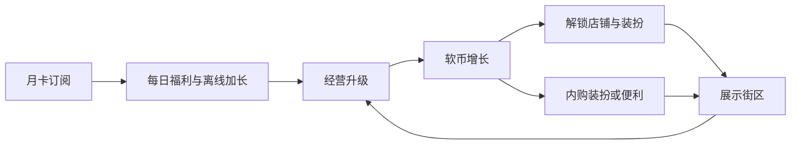

# 《街区小老板》游戏设计文档

| 字段 | 内容 |
|------|------|
| 工作标题 | 街区小老板（可改名） |
| 品类 | 放置 / 模拟经营 |
| 平台 | Android + iOS APP（MVP 可用 Web/本地原型验证） |
| 目标年龄 | 10～15 岁（少年向，非低幼） |
| 变现 | **无广告**；装扮/便利向内购 + 月卡/季卡订阅 |
| 收入目标 | 上线稳定后，平均月收入约 **人民币 1 万元** |
| 文档版本 | v1.0 |
| 日期 | 2026-08-04 |

**一句话定位**：轻松扩店的放置经营，用好看装扮和省时会员赚钱，不靠广告。

---

## 1. 产品定位

### 1.1 目标用户

| 维度 | 定义 |
|------|------|
| 年龄 | 10～15 岁为主；家长可能代付或陪同开通订阅 |
| 动机 | 想「当老板」、看数字涨、把街区装好看、课间/睡前短时刷一下 |
| 设备 | 手机为主；会话短（5～15 分钟）+ 离线挂机 |
| 付费心理 | 愿为好看皮肤、月卡便利付小额；反感被逼氪、随机抽卡 |

### 1.2 使用场景

- 放学后 / 睡前：领离线收益、升一两级、换装扮
- 周末：解锁新店、冲每日任务、逛装扮图鉴
- **不设计**长时间肝爆、强实时对战、开放聊天

### 1.3 竞品对标（方向，非抄袭）

- 同类：放置扩产、离线收益、店铺装修类经营
- 差异：少年街区题材（奶茶、文具、游戏厅等）；**零广告**；付费只买装扮与便利，不锁主线进度

### 1.4 产品边界（刻意不做）

- 不加任何广告（激励视频、插屏、开屏均不出现）
- 不做强社交、直播、UGC 开放聊天
- 首版不做复杂联机对战
- 不做随机抽卡 / 强 pay-to-win

---

## 2. 核心循环

### 2.1 在线循环

```
经营决策 → 升级产速 → 解锁新店/员工/科技 → 装扮展示 → 再经营
```

1. 玩家用**软币**升级店铺等级、招帮手、点科技节点  
2. 产速提升，解锁下一家业态与免费基础装扮  
3. 用软币或钻石换外观，街区「变好看」形成展示欲  
4. 回到升级与扩店，形成正反馈

### 2.2 离线循环

```
挂机产币（有上限）→ 回游戏一键领取 → 投入升级 / 装扮 → 再离线
```

- 离线收益按「离开时产速 × 离线时长」计算，**有封顶**（默认 4 小时；订阅可延长，见第 5 章）
- 回游戏必须主动领取，避免「偷偷扣钱感」；领取后立刻可花，爽点清晰

### 2.3 循环关系图



### 2.4 核心爽点（设计优先级）

1. **回来看看涨了多少钱**（离线领取动画 + 数字滚动）  
2. **街区又变好看了**（装扮、主题、招牌）  
3. **又解锁一家新店**（内容节奏，非数值碾压）

---

## 3. 世界观与内容骨架

### 3.1 设定

玩家接手一条「少年街区」，从路边小摊做到整条街的小老板。NPC 为同学、店员、街坊，语气轻松、无暴力与不良诱导。

### 3.2 业态解锁顺序（MVP 建议 5 店）

| 顺序 | 业态 | 解锁条件（示意） | 玩家体感 |
|------|------|------------------|----------|
| 1 | 路边小摊 | 开局赠送 | 立刻能点升级 |
| 2 | 奶茶店 | 小摊达 Lv.5 或累计营收达标 | 第一次「开新店」高潮 |
| 3 | 文具店 | 奶茶达 Lv.8 + 主线任务 | 扩店感 |
| 4 | 游戏厅 | 街区评级 B | 少年向高潮内容 |
| 5 | 综合商场入口 | 前四店均达标 | MVP 终局目标；后续可 DLC 扩街 |

后续版本可加：书店、球鞋店、电影院售票亭等，按赛季主题更新。

### 3.3 主角与展示

- 可换装角色站在街区入口；装扮分「免费图鉴进度奖励」与「商店内购」
- 街区主题：白天/傍晚/节日灯饰等；订阅专属主题每月可轮换 1 个

---

## 4. 系统清单

### 4.1 货币双轨

| 货币 | 获取 | 用途 | 原则 |
|------|------|------|------|
| **软币（街区币）** | 经营产出、任务、离线领取 | 升级店铺、招人、基础装修 | 主进度只用软币即可完整通关 MVP |
| **钻石** | 成就、每日任务、订阅每日礼、少量内购礼包 | 便利道具、高级装扮、主题 | **不可**用钻石买「不可用软币获得的关键产速碾压」 |

钻石产速加成若存在，仅限订阅小幅加成（见 5.2），且免费玩家可通过时间追平内容解锁，不允许「不氪无法解锁下一店」。

### 4.2 店铺系统

- 每店：等级、基础产速、升级费用曲线（前缓后陡，避免前 10 分钟卡死）
- 升级反馈：等级数字、店面外观微变（招牌、座位）、产速飘字

### 4.3 员工系统

- 每店最多 2～3 名帮手；用软币雇佣与升级  
- 效果：产速%、离线收益轻微加成  
- 员工有简单立绘与一句口头禅（增加人格，不加复杂养成）

### 4.4 科技树（轻量）

- 街区共用科技页：如「打包加速」「招牌吸引」「库存扩容」  
- 节点用软币解锁；部分外观类节点可用钻石  
- 作用：提供中期目标，避免只会点「升级」一个按钮

### 4.5 任务与每日目标

| 类型 | 示例 | 奖励 |
|------|------|------|
| 新手引导 | 升级小摊 3 次、雇佣第 1 人 | 软币 + 解锁奶茶店前置 |
| 每日 | 领取离线 1 次、升级任意店 5 次、更换 1 次装扮 | 软币 / 少量钻石 |
| 成就 | 累计营收、集齐某套免费装扮 | 钻石、称号、边框 |

每日任务控制在 **3 条**，预计 5～10 分钟完成，适配学龄作息。

### 4.6 装扮图鉴

- 分类：角色服装、发型、街区地砖、招牌、节日装饰  
- 图鉴收集度给软币/钻石里程碑奖励  
- 内购装扮计入图鉴（标明「商店获得」），避免玩家以为「漏肝」

### 4.7 排行榜（轻量）

- MVP：**可不联网**，本地「历史最高产速 / 街区评级」自比即可  
- 联网版：周榜「本周营收」「装扮收集度」；仅展示昵称与分数，**无私聊**  
- 昵称默认随机生成，可改；需敏感词过滤

### 4.8 存档

- MVP：本地存档（设备内）  
- 后续：游客 ID + 可选账号绑定云存档，便于换机与防丢

---

## 5. 变现设计（无广告）

### 5.1 原则

1. **主线与店铺解锁不收费**  
2. 付费买的是：更好看、更省时、更好领（便利），不是「别人有店你没有」  
3. **禁止**：随机抽卡逼氪、开箱子概率付费、付费才能通关、误导「最后一步必须付钱」  
4. 所有付费点需清晰标价（人民币），订阅写清周期与取消方式（商店规范文案）

### 5.2 订阅：月卡 / 季卡

| 项目 | 月卡 | 季卡 |
|------|------|------|
| 建议标价 | ¥12 / 月 | ¥30 / 季（约 ¥10/月） |
| 每日钻石 | 20 / 天（需登录领取） | 同月卡 |
| 离线上限 | 4h → **8h** | 同月卡 |
| 产速 | **+5%**（全体软币产出） | 同月卡 |
| 专属 | 月卡边框 + 当月主题装扮 1 套 | 含月卡权益 + 季卡限定称号 |
| 其他 | 每日软币小礼包 | 同左 |

- 未订阅玩家：完整可玩；离线 4h 封顶；无 +5%  
- **+5% 刻意做小**，避免 pay-to-win 观感；卖点主打「离线更久 + 每日钻石 + 好看」

### 5.3 内购（一次性）

| 商品类型 | 建议价位 | 说明 |
|----------|----------|------|
| 单件装扮 / 小套装 | ¥3～6 | 皮肤、发型、招牌 |
| 主题包（街区主题） | ¥6～12 | 一整套视觉 |
| 便利：加速券包 | ¥3～6 | 限量；有日使用上限（如加速合计不超过 30 分钟/日） |
| 便利：双倍产出（限时） | ¥6 | 如 30 分钟双倍；有冷却，防肝与防逼氪 |
| 钻石小礼包 | ¥6 / ¥12 / ¥30 | 明码；不做「首充翻倍连环坑」诱导儿童 |
| 去推送打扰（可选） | ¥3 或并入月卡 | 若做本地通知，付费可默认安静 |

**不做**：战斗力付费碾压包、开服限时全屏强弹（合规与体验双杀）。

### 5.4 付费弹窗与家长向

- 首次进入商店：短文案说明「本游戏无广告；内购需经家长同意」  
- iOS/Android 走系统支付与家庭购买审批（文档要求接入商店能力，实现阶段对接）  
- 不在升级失败时弹「充值即可升级」；升级不够钱时只提示做任务 / 离线领取

### 5.5 收入结构目标（稳定期）

- 订阅：约 **50%～60%** 月收入（留存付费）  
- 装扮/主题：约 **30%～40%**  
- 便利与钻石包：约 **10%～15%**  

---

## 6. 月入约 1 万人民币路径（测算）

以下为**产品侧可执行假设**，用于定 DAU 与付费设计目标，非承诺。

### 6.1 公式

```
月收入 ≈ DAU × 付费率 × 付费用户月 ARPU × 30 / 平均日活折算
```

更常用简化（按月活付费）：

```
月收入 ≈ 月付费人数 × 付费用户月均贡献
或
月收入 ≈ DAU × 7%付费率 × ¥18 ARPU（当月）× 约 1（若按「日活中的付费当月贡献」需再校准）
```

下面用**清晰可对标**的三档情景（人民币）。

### 6.2 商品与 ARPU 假设

| 付费行为 | 单价 | 假设占比（付费用户中） |
|----------|------|------------------------|
| 仅买小装扮 | ¥6 | 40% |
| 月卡 | ¥12 | 35% |
| 季卡（摊到月） | ≈¥10 | 10% |
| 主题包 / 钻石包 | ¥12～30 | 15% |

综合假设：**付费用户月 ARPU ≈ ¥15～20**（取 **¥18** 作达标测算）。

### 6.3 达月入 ¥10,000 的门槛

目标：`月付费人数 × ¥18 ≈ ¥10,000`  
→ **月付费人数 ≈ 556 人**

| 情景 | DAU | 日→月付费转化假设 | 月付费人数（约） | 月收入（约） |
|------|-----|-------------------|------------------|--------------|
| 保守 | 400 | 付费率 3%，且付费用户月均贡献折算后偏低 | ~350 | ~¥6,300 |
| **达标** | **500** | **付费率约 4%～5%，ARPU ¥18** | **~550** | **~¥9,900** |
| 舒适 | 800 | 付费率 5%，ARPU ¥20 | ~800+ | ~¥16,000 |

**达标结论（设计目标）**：

- 稳定 **DAU ≈ 500**（或 MAU 约 2,000～3,000 且周留存健康）  
- **付费率约 4%～5%**（无广告下靠月卡 + 好看装扮可达成，需内容更新支撑）  
- **付费 ARPU ≈ ¥18 / 月**  

未达 DAU 时：优先做留存与内容更新，而不是加广告或加重 pay-to-win。

### 6.4 冷启动（产品侧可执行）

| 阶段 | 指标焦点 | 动作 |
|------|----------|------|
| 原型 | 新手 10 分钟完成率 ≥ 70% | Web/单机包测核心循环 |
| 软启动 | D1 ≥ 35%，D7 ≥ 12% | 小范围投放或校园/社群试玩；只收软币经济反馈 |
| 变现开闸 | 付费率试探 3%+ | 上月卡 + 2～3 套装扮；看退订与差评 |
| 稳定冲 1 万 | DAU 冲 500 | 双周更新 1 个主题或 1 家新店；节日装扮档期 |

更新节奏建议：**每 2 周**一小更（任务、装扮、平衡）；**每 6～8 周**一中更（新业态或大主题）。

### 6.5 渠道备注

- 应用商店：分类「模拟 / 休闲」；截图突出「开店 + 装扮 + 无广告」  
- 素材：离线领取数字滚动、街区前后对比、月卡权益三条  
- 不依赖单一买量；内容题材利于短视频「开箱装扮 / 从零开街」

---

## 7. 进度、数值与留存

### 7.1 新手前 10 分钟

| 分钟 | 目标 | 成功标准 |
|------|------|----------|
| 0～2 | 点升级、看产速变化 | 完成强制引导，无卡死 |
| 2～5 | 雇第 1 人、领第一次小额离线模拟（可短时） | 理解「离开也会赚」 |
| 5～8 | 解锁或接近解锁奶茶店 | 强高潮 |
| 8～10 | 换一次免费装扮 / 看图鉴 | 埋下付费审美钩子（不逼买） |

### 7.2 D1 / D7 钩子

- **D1**：隔夜离线接近封顶；登录领「昨日营业报告」；每日任务第三条指向装扮  
- **D3**：文具店解锁预告（差一点点）  
- **D7**：街区评级结算 + 周任务宝箱（免费钻石）；同步推出当周装扮上新  

### 7.3 防肝（学龄适配）

- 单次有效操作建议 **5～15 分钟**打满日常  
- 加速与双倍有日上限  
- 深夜（可配置，如 22:00–7:00）减少推送；默认推送克制  
- 无强制体力墙；软币不够就提示离线/任务，不弹充值

### 7.4 数值原则（实现时遵守）

- 前 30 分钟升级点击有明显反馈，费用曲线平缓  
- 中期靠「开新店」拉节奏，而非单店等级无脑堆到 999  
- 订阅 +5% 与加速不改变「下一店解锁条件」的可达性

---

## 8. 合规与商店政策（10～15 岁）

### 8.1 年龄与分级

- 内容：无色情、无赌博、无恐怖、无重度暴力；经营与装扮向  
- 商店年龄分级按实际审核填写（目标适合 10+ / 青少年）  
- 中国区上架：需 **适龄提示**；若达到必须实名/防沉迷的范畴，按当时政策接入（本阶段文档要求预留，MVP 可先单机不联网）

### 8.2 付费与家长

- 文案与 UI 避免催促儿童独自付费  
- 接入系统「购买需确认 / 家庭共享审批」能力  
- 订阅页写清价格、周期、取消路径  

### 8.3 隐私与账号

- 最小化采集；能游客玩则游客  
- 隐私政策与权限说明（相册等非必要不申请）  
- 排行榜仅昵称 + 分数；无私信、无 UGC 聊天  

### 8.4 广告政策（本产品）

- **产品承诺：零广告 SDK、零广告位**  
- 商店简介与开屏可写「无广告」，与实现一致，避免误导  

---

## 9. 美术、UI 与音频

### 9.1 视觉

- 明亮少年向；可用清晰插画或轻度 2.5D 街区  
- **避免**：低幼粉嫩堆砌、成人酒吧风、过度霓虹炫光  
- 字体：可读性优先；标题可稍有个性，正文清晰  
- 装扮为付费门面：套装需「一眼能看出变化」

### 9.2 UI 信息架构（主界面）

- 中央：街区俯视/斜 45° 可点店铺  
- 底栏：店铺、科技、任务、装扮、商店  
- 顶栏：软币、钻石、离线领取入口、设置  

### 9.3 音频

- 轻快短循环 BGM；升级与领币有清脆反馈音  
- 可一键静音；默认音量适中  

---

## 10. 技术与里程碑

### 10.1 技术取向（文档级建议）

| 阶段 | 方案 |
|------|------|
| MVP 原型 | 单机：HTML5 / Unity / Godot 任一；本地 JSON 存档 |
| 正式 APP | Unity 或 Flutter+自研逻辑 等可上架方案；IAP 接官方商店 |
| 后端（二期） | 账号、云存档、周榜、收据校验 |

### 10.2 里程碑

| 阶段 | 交付 | 验收 |
|------|------|------|
| M0 文档 | 本设计文档 | 玩法/变现/合规对齐 |
| M1 核心原型 | 1～2 店升级 + 离线领取 + 本地存档 | 10 分钟循环跑通 |
| M2 内容 MVP | 5 店 + 任务 + 装扮图鉴（含免费套） | D1 钩子可演示 |
| M3 变现占位 | 月卡/装扮商品表 + 商店 UI；沙盒支付或商店沙盒 | 无广告；主线不锁 |
| M4 软启 | 小范围安装包 + 基础统计（留存、付费漏斗） | D1/付费率有数 |
| M5 上架 | 双端商店、隐私合规、适龄提示 | 冲 DAU 与月入目标 |

### 10.3 MVP 明确范围

**做**：放置升级、离线封顶领取、双货币、任务、装扮、本地存档、商店 UI（内购可先占位）  
**不做**：广告、联机对战、聊天、抽卡、复杂养成

---

## 11. 风险与对策

| 风险 | 对策 |
|------|------|
| 无广告导致 ARPU 不够 | 强化月卡价值感（离线 8h + 每日钻 + 主题）；保持装扮上新 |
| 数值崩导致弃坑 | 内测专人盯前 7 日曲线；热更升级费用 |
| 儿童误购差评 | 家长向说明 + 系统购买确认；客服退款流程预置 |
| 同质化 | 少年街区题材 + 零广告卖点 + 装扮社交展示（周榜收集度） |
| 合规政策变化 | 实名/防沉迷/隐私模块化，可开关升级 |

---

## 12. 成功标准（上线 3 个月内）

| 指标 | 目标 |
|------|------|
| 新手 10 分钟完成率 | ≥ 70% |
| D1 / D7 | ≥ 35% / ≥ 12% |
| 付费率 | ≥ 4% |
| 付费 ARPU | ≥ ¥15 |
| DAU | 向 500 推进 |
| 月收入 | 向 ¥10,000 推进 |
| 广告 | 始终为 0 |

---

## 附录 A. 术语表

| 术语 | 含义 |
|------|------|
| 软币 / 街区币 | 免费主货币 |
| 钻石 | 高级货币 |
| 离线封顶 | 挂机收益最长累计时长 |
| 街区评级 | 由店铺等级与图鉴等算出的综合分 |
| 便利道具 | 加速、限时双倍等，有上限 |

## 附录 B. 首版商品列表示意

| ID | 名称 | 类型 | 价格 |
|----|------|------|------|
| sub_month | 小老板月卡 | 订阅 | ¥12 |
| sub_season | 小老板季卡 | 订阅 | ¥30 |
| cos_starter_pack | 开学季套装 | 内购 | ¥6 |
| theme_evening | 傍晚灯饰主题 | 内购 | ¥12 |
| boost_small | 加速券×5 | 内购 | ¥3 |

（正式上架 ID 与商店后台配置一一对应。）

---

*本文档为《街区小老板》设计基线。实现阶段若调整数值或业态，应同步更新本章节版本号与变更记录。*
